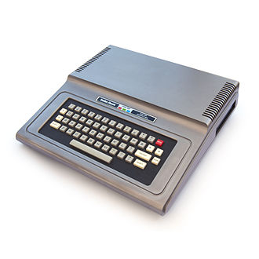

# TRS-80 Color Computer

## Overview

The TRS-80 Color Computer (CoCo) family is an 8-bit home computer line released by Tandy/Radio Shack beginning in 1980. It offers a BASIC-driven environment, a Motorola 6809E CPU and an expanded palette compared to Commodore counterparts. REG-Linux uses the `coco` system group so metadata and artwork align with the platform.

## Technical specifications

- CPU: Motorola 6809E/1 at 0.895–1.79 MHz
- Memory: 4 KB (Model I) up to 64 KB (Model III/4) plus ROM expansions
- Graphics: MC6847 VDG supporting 256×192 with limited colors
- Sound: Simple tone generator via MC6847

## Supported ROM extensions

`wav`, `cas`, `ccc`, `rom`, `zip`, `7z`

## Quick reference

- **Emulator:** MAME
- **ROM folder:** `/userdata/roms/coco`
- **Accepted formats:** `.wav`, `.cas`, `.ccc`, `.rom`, `.zip`, `.7z`

## BIOS

MAME requires the `coco.zip` (or `.7z`) archive, which contains the Color Computer ROM images. Place it in `/userdata/roms/coco/` or in the global `bios/` directory; the filename and checksum must remain unchanged so REG-Linux can detect it.

## ROMs

Store cassette, disk and cartridge images under `/userdata/roms/coco`. MAME’s autoload behavior handles `.cas`, `.dsk`, `.wav` and `.rom` files automatically, but you can override defaults via `system/configs/mame/autoload/coco_{cass,flop}_autoload.csv` using the syntax `<romBasename>;<autoload command>` (the CSV files contain detailed examples).

## Emulators

### MAME

[MAME](https://www.mamedev.org/) includes the TRS-80 Color Computer driver. Open the in-game menu (`[HOTKEY]` + south button or `Tab`) to remap inputs, attach media or adjust video/audio options. Standardized REG-Linux features for CoCo include `coco.videomode`, `coco.decoration` and `coco.padtokeyboard`.

| ES setting name REG-Linux.conf_key | Description => ES option key_value |
| --- | --- |
| Settings that apply to all versions of this emulator |  |
| VIDEO MODE `coco.video` | Choose BGFX for shaders or Accel/OpenGL for direct rendering.  => BGFX `bgfx`, Accel `accel`, OpenGL `opengl`. |
| BGFX GRAPHICS API `coco.bgfxbackend` | Specify the backend when BGFX is active.  => MAME Detect `automatic`, OpenGL `opengl`, OpenGL ES `gles`, Vulkan `vulkan`. |
| BGFX VIDEO FILTER `coco.bgfxshaders` | Apply CRT/smoothing filters.  => Off `None`, Bilinear `default`, CRT Geom `crt-geom`, CRT Geom Deluxe `crt-geom-deluxe`, Super Eagle `eagle`, HLSL `hlsl`, HQ2X `hq2x`, HQ3X `hq3x`, HQ4X `hq4x`. |
| ALT DPAD MODE `coco.altdpad` | Adjust D-pad orientation when controllers behave oddly.  => Off `0`, DS3 `1`, X360 `2`. |
| SPECIAL CONTROL LAYOUTS `coco.altlayout` | Alternate layouts for modern pads.  => Default `0`, SNES `1`, Genesis `4`, etc. |
| MEDIA TYPE `coco.altromtype` | Specify media (cassette vs cartridge) if MAME misdetects.  => Cassette `cass`, Cartridge `cart`. |
| UI KEYS `coco.enableui` | Toggle MAME’s UI key bindings at startup.  => Off `0`, On `1`. |

## Controls

The TRS-80 Color Computer has a variety of input methods. The default mapping appears on a REG-Linux Retropad overlay (`../images/controller-overlays/coco.png`). Use RETROARCH/MAME menus to remap joystick/keyboard combos or supply custom keypad actions.

## Troubleshooting

- Confirm the `coco.zip` BIOS archive exists in the ROM or BIOS folder and matches the expected checksum.
- If a media file misbehaves, specify the correct `coco.altromtype` (cassette vs cartridge) or override autoload commands via the CSV files noted above.
- Consult the [MAME troubleshooting section](mame.md#troubleshooting) for system-specific issues.
