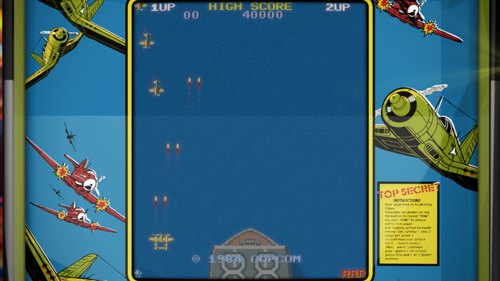

# LCD Games

## Overview

This umbrella system covers handheld LCD toys and fast-food promotions from the 1980s and 1990s (Tiger Electronics, Coleco, and similar hardware). REG-Linux groups every LCD-format dump under the `lcdgames` system tag so metadata scraping and theming remain consistent across these simple devices.

## Supported ROM extensions

`mgw`, `zip`, `7z`

## Quick reference

- **ROM folder:** `/userdata/roms/lcdgames`
- **Accepted ROM formats:** `.mgw`, `.zip`, `.7z`
- **Emulators:** RetroArch (`libretro: mame`), standalone MAME
- **System group:** `lcdgames`

## BIOS

No BIOS files are required for LCD games emulation.

## ROMs

Put LCD handheld images in `/userdata/roms/lcdgames`. MAME/MESS can load `.mgw` snapshots directly; zipped collections and `.zip`/`.7z` archives are also accepted. Nintendo Game & Watch dumps can live here, but they may benefit from the dedicated Game & Watch system, with both systems optionally grouped under a single LCD collection in EmulationStation.

## Emulators

### RetroArch (`libretro: mame`)

[RetroArch](https://docs.libretro.com/) brings the `libretro: mame` core to LCD handhelds so you can share hotkeys, overlays, shaders and rewind support across devices.

#### RetroArch configuration

While a core is running, open the **Quick Menu** with `[HOTKEY]` + the south face button (see controller configuration) to edit options, controller mappings and shaders. REG-Linux mirrors many of those toggles through EmulationStation menus.

Standardized settings include `lcdgames.videomode`, `lcdgames.ratio`, `lcdgames.smooth`, `lcdgames.shaders`, `lcdgames.pixel_perfect`, `lcdgames.decoration`, `lcdgames.game_translation`, `lcdgames.audio_latency`, `lcdgames.video_threaded`.

| ES setting name | REG-Linux.conf_key | Description & values |
| --- | --- | --- |
| GRAPHICS API | `lcdgames.gfxbackend` | Choose OpenGL (`opengl`) or Vulkan (`vulkan`). |
| AUDIO LATENCY | `lcdgames.audio_latency` | Buffer size in milliseconds: 256, 192, 128, 64, 32, 16, 8. Increase if you hear crackles. |
| THREADED VIDEO | `lcdgames.video_threaded` | Use an extra thread for rendering (`true` On, `false` Off). |

### MAME

[MAME](https://www.mamedev.org/) can be launched directly for LCD devices. Hit `[HOTKEY]` + the south button or `[Tab]` to open the MAME menu and change inputs, video filters or controller types.

#### MAME configuration

Standardized options include `lcdgames.videomode`, `lcdgames.decoration`, `lcdgames.padtokeyboard` plus the global BGFX/resolution options.

| ES setting name | REG-Linux.conf_key | Description & values |
| --- | --- | --- |
| VIDEO MODE | `lcdgames.video` | BGFX post-processing, Accel or OpenGL rendering. |
| BGFX GRAPHICS API | `lcdgames.bgfxbackend` | Select backend when BGFX is enabled. |
| BGFX VIDEO FILTER | `lcdgames.bgfxshaders` | Apply shaders such as `crt-geom`, `hq2x`, `eagle`, etc. |
| CRT SWITCHRES | `lcdgames.switchres` | Allow switch-res profiles (`0` Off, `1` On). |
| VERTICAL ROTATION | `lcdgames.rotation` | Rotate output for TATE titles. |
| ALT DPAD MODE | `lcdgames.altdpad` | Reorient the d-pad for unusual controllers. |

## Controls

Each LCD handheld had its own input set; MAME maps those buttons to the REG-Linux Retropad with reasonable defaults. The layout can be adjusted through the emulator menus or per-game overrides.

